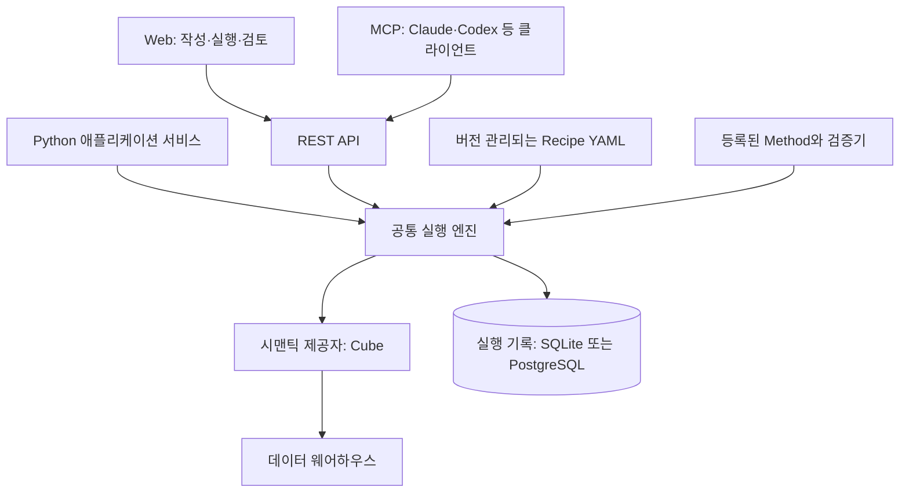

# Decision Layer

[English](README.md) | [한국어](README.ko.md)

시맨틱 레이어와 AI 에이전트에서 재사용하는 분석 절차.

[빠른 시작](#빠른-시작) · [아키텍처](#아키텍처) · [MCP](#ai-클라이언트-연결) · [기여하기](CONTRIBUTING.md)

Decision Layer는 분석가의 조사 절차를 **Recipe**로 만들어, 사람과 AI 에이전트가 조직에서 관리하는 지표를 바탕으로 실행할 수 있게 합니다.

시맨틱 레이어는 매출이 무엇인지 정의합니다. Recipe는 매출 변화를 어떻게 조사할지 정의합니다. 기간을 비교하고, 상품·지역별로 변화를 분해하고, 관련 그룹을 더 살펴보는 식입니다. Decision Layer는 등록된 분석 방법을 실행하고 입력, 결과, 검증, 쿼리 근거를 기록합니다.

**현재 상태: 초기 개발 단계입니다.** 시맨틱 제공자로 Cube를 지원합니다. Recipe 편집과 실행은 사용할 수 있으며, 작성 경험 단순화와 MCP 실행 기록에서 만든 Recipe 초안의 승인 흐름은 개발 중입니다.

## 왜 Decision Layer인가요?

- **조직의 분석 지식을 재사용합니다.** 매번 프롬프트를 새로 작성하는 대신 분석 절차를 버전이 있는 Recipe YAML로 관리합니다.
- **이미 관리하는 지표를 사용합니다.** 지표의 의미, 조인, 접근 규칙을 다시 정의하지 않고 Cube의 지표와 차원을 참조합니다.
- **AI에 범위가 정해진 분석 도구를 제공합니다.** MCP 클라이언트가 등록된 Method와 Recipe를 선택하면 서버가 실행하고 검증합니다. 서버에는 LLM을 두지 않으며, AI가 생성한 분석 코드를 실행하지 않습니다.
- **결과의 근거를 확인합니다.** Run에 Method 버전, 입력, 결과, 경고, 시맨틱 쿼리를 보관합니다. 제공자가 SQL을 반환하면 함께 기록합니다.

Decision Layer는 분석 절차를 실행하는 계층입니다. 대시보드 제작 도구, 시맨틱 모델 편집기, 스케줄러를 지향하지 않습니다.

## 빠른 시작

Git과 Docker Compose가 필요합니다.

```bash
git clone https://github.com/haechangcho/decision-layer.git
cd decision-layer/examples/ecommerce
docker compose up --build
```

예제에는 합성 이커머스 데이터, PostgreSQL, Cube, API, 웹 앱이 포함됩니다. 별도의 데이터 웨어하우스 계정이나 LLM API 키는 필요하지 않습니다.

| 서비스 | 주소 |
| --- | --- |
| 웹 앱 | http://localhost:3000 |
| REST API 문서 | http://localhost:8000/docs |
| Cube Playground | http://localhost:4000 |

웹 앱에서 Recipe를 선택하고, [예제 시나리오](examples/ecommerce/evals/scenarios.json)의 기간으로 실행해 보세요. 생성된 Run에서 각 단계와 실행 근거를 확인할 수 있습니다. 지표 카탈로그는 `/catalog`, 연결 설정은 `/sources`에 있습니다.

이 예제는 고정된 예제 자격 증명과 Cube 개발 모드를 사용하는 **로컬 개발용 데모**입니다. Recipe 편집 키는 `local-demo-change-me`입니다. Cube 연결은 환경변수로 설정되어 있으므로 화면에서는 해당 설정이 잠겨 표시됩니다.

기본 포트를 이미 사용 중이라면 다음처럼 변경합니다.

```bash
WEB_PORT=3001 API_PORT=8001 CUBE_PORT=4001 docker compose up --build
```

실행 기록은 `runs` Docker 볼륨에 유지됩니다. Recipe 편집 내용은 마운트된 `examples/ecommerce/recipes/` 디렉터리에 저장됩니다. `docker compose down`으로 종료할 수 있으며, `-v`를 추가하면 실행 기록 볼륨도 삭제됩니다.

모델, 예제 데이터, 예상 결과는 [예제 가이드](examples/ecommerce/README.md)를 참고하세요.

## 아키텍처



| 구성 요소 | 역할 |
| --- | --- |
| 시맨틱 레이어 | 지표, 차원, 조인, 데이터 단위(grain), 데이터 접근 정책 |
| Method | 입력·출력·검증을 명시한 원자적인 분석 기능 |
| Recipe | 기존 Method와 시맨틱 참조로 구성한 조직의 분석 절차 |
| Run | 단계, 결과, 근거를 포함한 한 번의 실행 기록 |
| Web / REST / MCP | 같은 명세와 실행 엔진을 사용하는 인터페이스 |

Recipe는 Git으로 관리할 수 있는 파일로 유지합니다. Run은 DB에 저장하며, 로컬 기본값은 SQLite이고 PostgreSQL도 지원합니다. 데모의 PostgreSQL은 합성 원천 데이터를 저장하고, Run은 별도 볼륨의 SQLite에 저장합니다.

오래 걸리는 분석은 백그라운드 작업으로 실행합니다. API는 조회 안내와 함께 `202`를 반환할 수 있습니다. 현재 작업은 API 프로세스 내부에서 실행되며, 프로세스가 재시작되면 실행 중이던 작업을 재개하지 않습니다.

[아키텍처 문서](docs/ARCHITECTURE.md)에서 계약을 설명하고, [ADR](docs/DECISIONS.md)에 현재 설계 결정을 기록합니다. 이전 설계 제안과 충돌하면 ADR을 우선합니다.

## 제공하는 Method

| Method | 용도 |
| --- | --- |
| `query.trend` | 추이와 기간 비교. 지원되는 통계적 판정과 기간 길이 검사 포함 |
| `query.drilldown` | 그룹별 분해, 하위 항목 탐색, 변화에 대한 기여 분석 |
| `causal.cem` | 균형·비교 가능성 진단을 포함한 조건 맞춤 비교 |

결과는 기술적(descriptive), 연관적(associational), 조건부 인과적(causal conditional) 해석을 구분합니다. 가능한 검사는 Method와 시맨틱 메타데이터에 따라 달라지며, 분석 결과가 곧 인과관계의 증명은 아닙니다.

[예제 Recipe](examples/ecommerce/recipes/)와 [Method 구현](src/decision_layer/methods/)을 살펴보세요.

## AI 클라이언트 연결

MCP 서버는 REST API를 호출하는 로컬 stdio 어댑터입니다. Python 3.11 이상에서 저장소 루트를 기준으로 실행합니다.

```bash
python3.11 -m venv .venv
.venv/bin/pip install -e '.[mcp]'
```

`mcpServers` 설정을 지원하는 클라이언트의 예시입니다.

```json
{
  "mcpServers": {
    "decision-layer": {
      "command": "/absolute/path/to/decision-layer/.venv/bin/decision-layer-mcp",
      "env": {
        "DL_API_URL": "http://localhost:8000"
      }
    }
  }
}
```

설정 형식이 다른 클라이언트에서는 해당 제품의 stdio 서버 설정을 사용하세요. 인증이 필요한 Cube에 연결할 때는 클라이언트의 비밀값 설정을 통해 `DL_TOKEN`에 유효한 호출자 토큰을 전달합니다. 기본 로컬 데모는 개발용 서비스 자격 증명을 사용합니다.

클라이언트는 MCP 도구로 시맨틱 객체와 Recipe를 찾고, Method를 실행하고, 조사를 이어가거나 Run을 조회할 수 있습니다. 적용 가능한 Recipe를 우선 사용하도록 안내합니다. 분석 실행은 API에서 기록하므로 적절한 사용자 신원과 권한으로 웹에서도 같은 Run을 조회할 수 있습니다.

예를 들어 "매출 변화를 조사하는 데 사용할 Recipe가 있어?"라고 질문해 보세요. 모델은 선택한 AI 클라이언트에서 실행되며, Decision Layer 내부에서 실행되지 않습니다.

## 기존 Cube 연결

`https://cube.example.com/cubejs-api/v1` 같은 Cube REST 주소를 API 서버에 설정하거나, 편집이 허용된 배포에서는 Sources 화면에서 설정합니다. API 서버가 접근할 수 있는 주소를 사용해야 합니다. Docker 내부의 `localhost`는 해당 컨테이너 자신을 가리킵니다.

호출자의 access token은 Cube로 전달됩니다. Cube가 해당 토큰을 허용하고 의도한 데이터 접근 규칙을 적용하도록 설정해야 합니다. 무인증 접근과 API secret 서명은 명시적으로 선택하는 개발용 옵션입니다.

| 설정 | 용도 |
| --- | --- |
| `CUBE_API_URL` | Cube REST API 주소 |
| `DL_DATABASE_URL` | 실행 기록·설정 저장소: SQLite 또는 PostgreSQL |
| `DL_RECIPES_DIR` | Recipe YAML 파일이 있는 디렉터리 |
| `DL_SOURCE_ADMIN_TOKEN` | 공유 배포에서 연결 설정을 관리할 권한 |
| `DL_RECIPE_ADMIN_TOKEN` | Recipe 작성 권한 |
| `DL_SOURCE_CONFIG_KEY` | 웹에서 저장하는 연결 비밀값의 암호화 키 |

환경변수는 저장된 연결 설정보다 우선합니다. 개발용 자격 증명과 기타 옵션은 [설정 예시](.env.example)를 참고하세요. 토큰이나 연결 비밀값을 Recipe 파일 또는 Git에 저장하지 마세요.

## 개발과 기여

로컬 API·웹 실행, 테스트, Method 기여 방법은 [CONTRIBUTING.md](CONTRIBUTING.md)에 정리되어 있습니다.

- [제품 배경](docs/PRODUCT_CONTEXT.md)
- [아키텍처와 계약](docs/ARCHITECTURE.md)
- [설계 결정](docs/DECISIONS.md)
- [구현 마일스톤](docs/PRODUCT_UX_MILESTONES.ko.md)
- [에이전트 작업 지침](AGENTS.md)

현재 우선순위는 Recipe 작성 단순화, 일관된 기본값, MCP 실행 기록을 Recipe 그래프 초안으로 바꾸고 사용자가 명시적으로 승인하는 검토 흐름입니다. 승인 흐름은 아직 제공되지 않는 예정 기능입니다.

## 라이선스

[Apache License 2.0](LICENSE).
