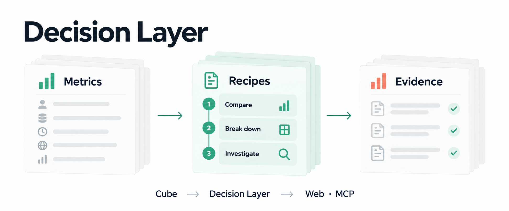

# Decision Layer

[문서](https://decision-layer-docs.vercel.app/ko/) · [English](README.md)

**팀의 분석 노하우를 반복해서 실행합니다.**

Decision Layer는 semantic layer의 지표를 등록된 분석 방법(**Method**)과 재사용 가능한 분석 절차(**Recipe**)로 연결합니다. 웹이나 AI 도구로 분석하고, 실행 기록(**Run**)에서 질문·단계·근거를 확인한 뒤 팀이 다시 쓸 절차로 저장합니다.

웹, Python, REST, MCP는 하나의 실행 엔진을 사용합니다. AI 도구는 등록된 Method와 Recipe를 선택하며 임의로 만든 분석 코드를 실행하지 않습니다.

답하지 못한 질문에는 데이터 모델 보완 제안을 남기고, 검토 후 재분석으로 연결할 수 있습니다. [사용 흐름](https://decision-layer-docs.vercel.app/ko/guides/runs#데이터-모델-보완과-재분석)을 참고하세요.



## 시작 경로

| 목적 | 시작 위치 |
| --- | --- |
| Method 개발 | 아래 Python 전용 예제 |
| 웹·API 개발 | [개발 환경](docs/ko/guides/development.md) |
| 실제 데이터로 체험 | [Complete Journey](examples/complete-journey/README.ko.md) |

## 첫 Method 개발

Python 3.11+만 있으면 시작할 수 있습니다.

```bash
git clone https://github.com/haechangcho/decision-layer.git
cd decision-layer
make setup
make example
```

`examples/methods/first_method/method.py`를 수정하고 `make example`을 다시 실행합니다.
fixture의 독립적인 예상값과 실제 요청한 기간·차원·정렬·조회 수를 검사합니다.
인증 정보, 웹 서버, Node, Docker 없이 실행됩니다. Make를 사용하지 않는 명령은
[Method 가이드](docs/ko/guides/methods.md)에 있습니다.

```bash
.venv/bin/python -m pytest -q examples/methods/peer_comparison
make test
```

peer 예제는 세 조회와 결과 조합을 검증합니다. 선택적으로 노트북에서 같은 Python
모듈을 import해 탐색할 수 있습니다. [기여 절차](CONTRIBUTING.md)를 참고하세요.

## 실제 데이터로 체험

Docker와 Compose가 있다면 다음을 실행합니다.

```bash
cd examples/complete-journey
docker compose -p decision-layer-cube up -d --build --wait --wait-timeout 900
```

[localhost:3000](http://localhost:3000)을 엽니다. 첫 실행은 데이터를 내려받아 가져오므로
몇 분 걸릴 수 있습니다. 처음에는 Recipe가 없습니다. AI 클라이언트를 [MCP로 연결](docs/ko/guides/mcp.md)하고,
분석을 실행한 뒤 웹의 Run에서 근거를 확인하고 Recipe로 저장합니다.
기존 환경은 [Cube](docs/ko/guides/cube.md) 또는 [공식 dbt API](docs/ko/guides/dbt.md)로 연결합니다.

[Apache 2.0](LICENSE)
