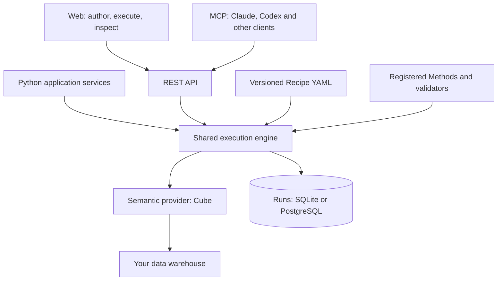

# Decision Layer

Reusable analysis procedures for semantic layers and AI agents.

[Quickstart](#quickstart) · [Architecture](#architecture) · [MCP](#connect-an-ai-client) · [Contributing](CONTRIBUTING.md)

Decision Layer turns an analyst's investigation process into a **Recipe** that people and AI agents can run against governed metrics.

A semantic layer defines what revenue means. A Recipe describes how to investigate a change: compare periods, break down the change by product and region, then examine the relevant groups. Decision Layer executes registered analytical methods and records the inputs, results, validation and query evidence.

**Status: early development.** Cube is the supported semantic provider. Recipe editing and execution are available; simpler authoring and approval of Recipe drafts derived from MCP runs are in progress.

## Why Decision Layer?

- **Keep analytical knowledge reusable.** Store an organization's procedures as versioned Recipe YAML instead of repeating ad hoc prompts.
- **Use the metrics you already govern.** Reference Cube metrics and dimensions without redefining their meaning, joins or access rules.
- **Give AI agents bounded analytical tools.** MCP clients choose registered Methods and Recipes. The server executes and validates them; there is no server-side LLM or generated analysis code.
- **Inspect the evidence.** Runs retain method versions, inputs, results, warnings and semantic queries, with SQL where the provider supplies it.

Decision Layer is an analysis layer, not a dashboard builder, semantic model editor or scheduler.

## Quickstart

Requires Git and Docker with Compose.

```bash
git clone https://github.com/haechangcho/decision-layer.git
cd decision-layer/examples/ecommerce
docker compose up --build
```

The example includes synthetic ecommerce data, PostgreSQL, Cube, the API and the web app. No warehouse account or LLM API key is needed.

| Service | URL |
| --- | --- |
| Web app | http://localhost:3000 |
| REST API documentation | http://localhost:8000/docs |
| Cube Playground | http://localhost:4000 |

Open the web app, choose a Recipe from the library, select a period from the [sample scenarios](examples/ecommerce/evals/scenarios.json), and run it. Open the resulting Run to inspect its steps and evidence. The catalog is at `/catalog`; connection settings are at `/sources`.

This is a **local development demo** with fixed example credentials and Cube development mode. The Recipe editing key is `local-demo-change-me`. The source is provisioned through environment variables, so its connection settings appear locked.

If the default ports are occupied:

```bash
WEB_PORT=3001 API_PORT=8001 CUBE_PORT=4001 docker compose up --build
```

Runs persist in the `runs` Docker volume. Recipe edits persist in the mounted `examples/ecommerce/recipes/` directory. Stop with `docker compose down`; adding `-v` deletes the Run volume.

See the [example guide](examples/ecommerce/README.md) for the model, sample data and expected results.

## Architecture



| Component | Responsibility |
| --- | --- |
| Semantic layer | Metrics, dimensions, joins, grain and data access policy |
| Method | One typed analytical capability with declared inputs, outputs and validation |
| Recipe | Organization-specific procedure using existing Methods and semantic references |
| Run | One execution, including its steps, results and evidence |
| Web / REST / MCP | Interfaces to the same specifications and execution engine |

Recipes remain files suitable for Git. Runs live in a database, with SQLite as the local default and PostgreSQL supported. The example's PostgreSQL stores the synthetic source data; its Runs use SQLite in a separate volume.

Long analyses run as background jobs. The API can return `202` with polling information. Jobs currently run inside the API process and do not resume after a restart.

The [architecture document](docs/ARCHITECTURE.md) explains the contracts; [ADRs](docs/DECISIONS.md) record current decisions and supersede older design proposals.

## Included Methods

| Method | Use |
| --- | --- |
| `query.trend` | Trends and period comparisons, including supported statistical judgments and period-length checks |
| `query.drilldown` | Group breakdowns, deeper exploration and contributions to changes |
| `causal.cem` | Matched comparisons with balance and comparability diagnostics |

Results distinguish descriptive, associational and conditional causal interpretations. Available checks depend on the Method and semantic metadata; a result is not automatically a causal explanation.

Explore the [example Recipes](examples/ecommerce/recipes/) or [Method implementations](src/decision_layer/methods/).

## Connect an AI client

The MCP server is a local stdio adapter to the REST API. With Python 3.11 or later, run from the repository root:

```bash
python3.11 -m venv .venv
.venv/bin/pip install -e '.[mcp]'
```

For clients that accept a `mcpServers` configuration:

```json
{
  "mcpServers": {
    "decision-layer": {
      "command": "/absolute/path/to/decision-layer/.venv/bin/decision-layer-mcp",
      "env": {
        "DL_API_URL": "http://localhost:8000"
      }
    }
  }
}
```

Use your client's equivalent stdio-server settings if its format differs. For an authenticated Cube deployment, pass a valid caller token through `DL_TOKEN` using your client's secret configuration. The bundled local demo uses development service credentials instead.

The tools let a client discover semantic objects, find Recipes, execute Methods, continue investigations and inspect Runs. Clients are instructed to prefer an applicable Recipe. Each analytical execution is recorded by the API, so the Web can retrieve the same Run with the appropriate identity and permissions.

Ask, for example: "Which Recipe can help investigate a change in sales?" The model runs in your chosen client, not in Decision Layer.

## Connect your own Cube

Configure the API with a Cube REST endpoint such as `https://cube.example.com/cubejs-api/v1`, or configure it through Sources when editing is enabled. Use an address reachable from the API server; inside Docker, `localhost` refers to the container itself.

Caller access tokens are forwarded to Cube. Cube must accept those tokens and enforce the intended data access rules. Anonymous access and API-secret signing are explicit development options.

| Setting | Purpose |
| --- | --- |
| `CUBE_API_URL` | Cube REST API endpoint |
| `DL_DATABASE_URL` | Run/configuration storage: SQLite or PostgreSQL |
| `DL_RECIPES_DIR` | Directory containing your Recipe YAML files |
| `DL_SOURCE_ADMIN_TOKEN` | Shared-deployment source configuration permission |
| `DL_RECIPE_ADMIN_TOKEN` | Recipe authoring permission |
| `DL_SOURCE_CONFIG_KEY` | Encryption key for source secrets saved through the Web |

Environment configuration takes precedence over saved source settings. See [the configuration template](.env.example) for development credentials and other options. Tokens and source secrets do not belong in Recipe files or Git.

## Development and contributing

See [CONTRIBUTING.md](CONTRIBUTING.md) for local API/Web setup, tests and the Method contribution path.

Useful starting points:

- [Product context](docs/PRODUCT_CONTEXT.md)
- [Architecture and contracts](docs/ARCHITECTURE.md)
- [Architectural decisions](docs/DECISIONS.md)
- [Implementation milestones (Korean)](docs/PRODUCT_UX_MILESTONES.ko.md)
- [Agent instructions](AGENTS.md)

Current priorities are simpler Recipe authoring, consistent defaults, and a review flow that turns MCP execution records into Recipe graph drafts for explicit user approval. That approval flow is planned, not yet available.

## License

[Apache License 2.0](LICENSE).
