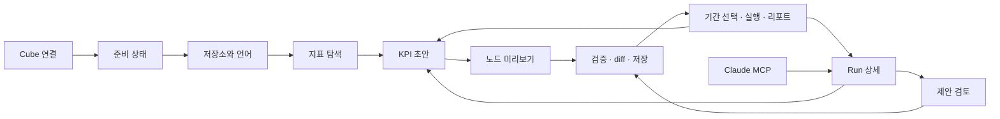

# U0 웹 여정 검토안

상태: 역사적 검토안, 2026-09-30. 초안은 기존 Next.js 앱의 `/design`에서 실행했다. 이후 제품 경로를 `/`(실제 API 기반 시맨틱 카탈로그), `/sources`(연결 설정), `/methods`, `/recipes`, `/runs`로 통합했다. `/design`은 `/`로 리다이렉트한다. 이 문서의 KPI 그래프·저장 흐름은 제안일 뿐이며 ADR-011 및 MVP_PLAN의 MVP 범위가 아니다. [현재 경로와 디자인 경계](U0_REDESIGN.ko.md)를 참조한다.

## 범위와 기존 결정

- 핵심 객체는 Semantic Source/Catalog, Method, Recipe, Run/Result다. KPI는 시맨틱 지표 참조와 재사용 분석 절차를 묶는 편집 진입점으로 제안한다. 지표 SQL이나 정의를 소유하지 않는다.
- ADR-011 및 MVP_PLAN의 KPI graph 제외와 요청이 충돌한다. 제안 범위는 분석 절차 편집이며 인과·가설·의사결정 그래프가 아니다. 그래도 기존 ADR 변경이 필요하므로 U3 전에 별도 결정한다.
- 연결 설정은 사용자 확인에 따라 웹 편집 + 환경변수 우선으로 결정했다. ADR-033이 ADR-025의 DB 용도를 연결 설정까지 확장한다. 실제 저장 기능은 U1에서 구현한다.
- ADR-021을 유지한다. 웹 질문창, 서버 LLM, 사용자 LLM 키 입력을 추가하지 않는다.
- 최신 Method 계약은 ADR-032의 `query.drilldown`, `query.trend`를 따른다. 오래된 문서의 compare/contribution/decompose를 새 화면에 되살리지 않는다.
- API가 반환한 판정만 표시한다. 검정을 수행하지 않은 기술적 분석에는 **유의성 미판정**을 사용한다. 유의하지 않음은 원인 부재나 분석 불필요를 뜻하지 않는다. 비교 불가는 데이터·가정 충족 실패와 구분해서 원인을 표시한다.

## 화면 흐름

| 화면 | 기본 선택과 주 동작 | 고급/실패 시 경로 |
|---|---|---|
| A1 연결 | URL, 인증 방식 → 테스트 → 준비 상태 | 환경변수 고정 필드 잠금. 주소·401·빈 카탈로그를 구분 |
| A2 점검 | 지표별 기능 준비 상태 → 저장소 설정 | 관련 Cube 선언 예시, 제한되는 Method, 다시 점검 |
| A3 저장소 | 서버의 허용된 로컬/Git 경로, 기본 언어 → 탐색 | GitHub 원격은 U3 전 결정. 임의 경로·명령 입력은 허용하지 않음 |
| B 탐색 | cube/view 그룹·검색 → 지표 상세 → KPI 등록 | 정의·참조·준비 상태·추이 쿼리. 추이 실패가 등록까지 막지 않음 |
| C 편집 | 후보 선택 → 기본 옵션 2~3개 → 미리보기 → 저장 | 전체 Method 파라미터, YAML, 검사 위치, diff |
| D 리포트 | 기간·비교 기간 → 실행 → 판정 → 다음 탐색 | 검증 경고, 쿼리, 스냅샷 SHA. 무의미한 변화의 원인을 자동 서술하지 않음 |
| E 기록 | Web/MCP Run → 단계 선택 → KPI 초안에 추가 | 출처·범위·권한·중복 검증. 제안은 근거와 변경 diff를 보고 승인 |

v2는 검토용 상태 선택을 주 화면에서 제거했다. 검색 결과 없음은 검색 입력으로, 연결 오류는 연결의 고급 설정에서, 읽기 전용은 도움말에서 확인한다. 실제 앱은 화면별 상태와 데이터 유무를 서버 응답에 연결해야 한다.

## 분석 계약의 주의점

준비 상태는 준비/누락/미확인/해당 없음으로 표현한다. 합계 지표에 분자·분모 누락 경고를 붙이지 않는다. ratio parts 선언이 있어도 건수 비율 검정의 조건이 만족된 것은 아니다. 기본 키 선언만으로 CEM 준비 완료를 표시하지 않는다. 조건층 집계 경로와 unit 경로의 요구사항도 다르다.

분자·분모 관계는 Cube에서 읽는 구성 관계이고 편집 불가다. 분석 연결은 실행 절차 또는 drill_path 관계다. 두 관계를 시각적으로 구분하고 인과관계로 표현하지 않는다. v2는 React Flow로 노드 이동과 확대·축소를 제공한다. 모바일에서는 같은 구성을 순서형 목록으로 표시한다. 다중 선택과 Recipe 묶기는 U3 범위다.

추천은 권한이 있는 카탈로그 안에서 같은 cube/view 후보를 우선한다. 같은 view라는 사실이 쿼리 가능성을 보장하지는 않는다. cardinality는 근거가 없으면 미확인으로 표시하고 숫자를 만들지 않는다. 미리보기에서 provider와 Method 검증을 수행한다.

조건 맞춤 비교는 처리 집단, outcome, 적절한 사전 조건, 필요한 grain을 명시한다. 연속 변수는 분포와 기준값을 확인한다. 추이 노드를 자동으로 인과 비교로 바꾸지 않는다. 결과에 관측된 조건에 대한 한계를 유지한다.

드릴다운 연속 탐색은 `drill_path`, 기존 필터, 비교 기간, 선택 집단 수와 보정 정보를 보존한다. 상위의 선택 맥락 없이 하위 검정을 새 분석처럼 표시하면 안 된다.

## API와 저장 설계 초안

| 계약 | 현재 상태 / 제안 |
|---|---|
| `/semantic/catalog`, `/semantic/objects`, `/sources/current/capabilities` | 현재 구현. 호출자 권한 기준 |
| `/methods/{name}:run`, `/runs`, `/runs/{id}/steps`, `/runs/{id}/result` | 현재 실행 경로 재사용. ADR-030의 202 + poll 계약 유지 |
| `GET/PUT /sources/current`, `POST /sources/current:test` | U1 추가 후보. 설정 읽기에 비밀값 반환 금지. 관리 권한과 키 운영 계약부터 확정 |
| `GET /sources/current/readiness` | U1. 기능별 상태, 사유 코드, 근거 ref, 해결 예시, 제한되는 Method |
| `GET /semantic/suggestions?metric=` | U3. stable ref·추천 사유·관측된 cardinality의 출처 |
| `GET /kpis`, `GET/PUT /kpis/{id}` | U2/U3. 경로에 slash가 있는 metric ref를 직접 넣지 않고 opaque ID 사용. 본문에 metric ref |
| `POST /kpis/{id}/nodes:preview` | 동일한 typed spec/validator/Method 실행. Run을 남기며 미저장 초안임을 기록 |
| `POST /kpis/{id}:analyze` | 기존 Run 모델로 실행. 노드별 진행, 실패, 중단 사유. 별도 실행 엔진 금지 |
| `GET /repo/status`, diff 및 commit | U3. 서버에서 검증된 파일만 저장. 예상 revision 불일치는 409로 재검토 |

웹 연결 편집의 암호화 키는 DB와 분리된 배포 secret에 둔다. 서버 설정 관리 권한을 Cube 조회 권한과 별도로 정의한다. 개발 secret만 암호화 저장하고 호출자의 토큰은 영구 공유 설정에 넣지 않는다. 환경변수 우선순위는 필드별로 반환한다. 테스트 성공이 영구 저장을 의미하지 않으며 실제 저장은 별도 동작이다.

KPI 저장 스키마와 Recipe의 관계는 U3 전에 확정한다. 우선 Recipe/PlanStep 재사용 가능성을 검토하고 새 실행 명세를 중복 정의하지 않는다. 저장은 YAML 파싱 → typed validation → 참조·권한 검사 → diff → revision 확인 → 원자적 파일 쓰기/커밋 순서다. 파싱 실패 시 마지막 유효한 캔버스를 유지한다. Git을 쓰지 않는 로컬 모드에는 커밋 SHA 대신 콘텐츠 해시를 기록한다.

환경변수가 있는 경우 실제 연결 설정은 환경변수를 따른다. 비밀값은 diff, 쿼리, 로그, Run 스냅샷에 넣지 않는다. GitHub 연결이나 push/PR 생성은 U0에서 수행하지 않는다.

## 검증 계획과 U0 한계

| 단계 | 구현 시 완료 기준 |
|---|---|
| U1 | URL과 필요한 인증을 제공한 새 환경에서 3분 내 카탈로그·점검. 주소/401/0개 상태 검증 |
| U2 | 검색 → 상세 → 미니 추이 → KPI 등록. 추이 오류·빈 카탈로그 복구 |
| U3 | 카테고리 → 판매자, 배송 소요일 추이의 미리보기·저장. drill_path·보정 보존, YAML 왕복, conflict·권한 거부 |
| U4 | 예시 데이터의 반품률 비유의 판정, 매출 일수 효과. 202 폴링·재시작 중단·부분 실패·검정 미지원 |
| U5 | 본인 MCP Run 단계 → 검증된 KPI 초안 → 저장. 중복·접근 권한·원본 provenance 유지 |

각 단계에 실제 서버와 연결된 Playwright 시나리오, 데스크톱/모바일 스크린샷 검토, 키보드 조작, 한국어/영어 문구 검증을 포함한다. 현재 U0 v2는 한국어 인터랙티브 프로토타입이다. 실제 번역, YAML 왕복, 202 폴링, 멀티 노드 Recipe 묶기, 공유 링크 및 제안 승인은 후속 구현 범위다. 프로토타입의 클릭 흐름이 해당 기능 구현 완료를 뜻하지 않는다. `web/tests/design/journey.spec.ts`는 고정 예시 데이터로 화면 여정을 검증한다.

연결 설정 방식은 확정했다. 남은 검토: 제한된 KPI 편집 범위의 ADR 변경, KPI/Recipe 저장 경로와 Git 원격. 화면에 대한 사용자 확인 전 U1~U5 기능 구현은 시작하지 않는다.
