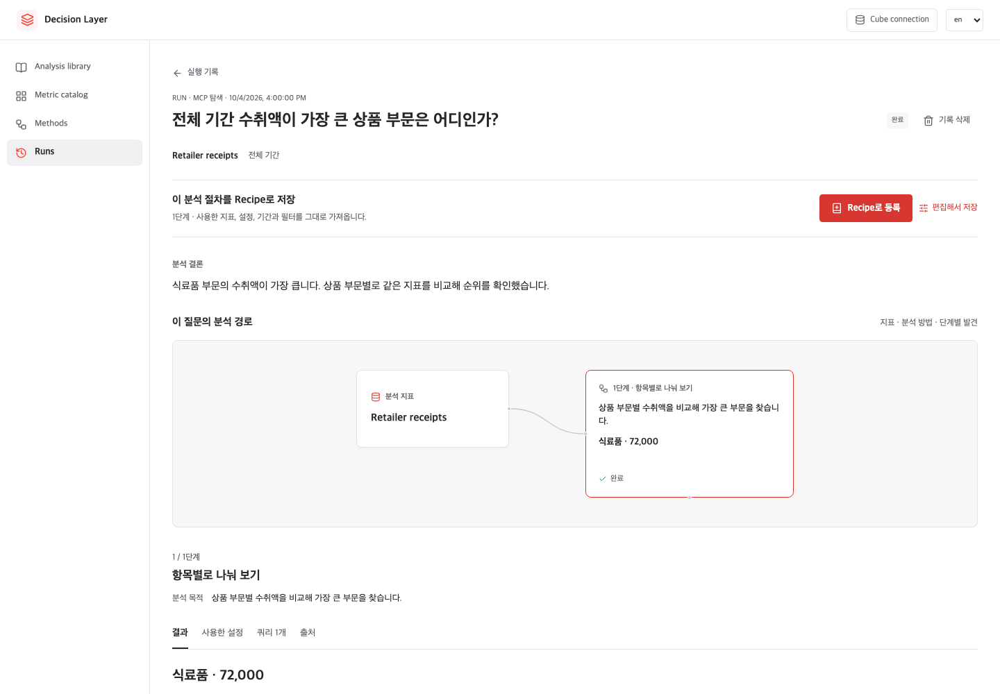

# 실행 기록과 근거

**Run**은 웹·REST·Python·MCP에서 실행한 분석 한 건입니다. 원래 질문이 전달됐다면 그 질문과 함께 각 단계의 Method, 지표, 설정, 결과, 검증과 쿼리를 저장합니다.

## 결과 읽기

### 분석 기간

기간 생략 또는 null은 전체 데이터가 아니라 선택 대기 상태입니다.
날짜를 지정할 때는 `scope.date_range`, 전체 기간을 명시할 때는
`scope.period: {mode: all}`을 사용합니다. 전체 기간은 서버 정책이 허용해야 합니다.
Recipe의 상대 기본 기간은 `{mode: relative, preset: last_complete_month, timezone: UTC}`
또는 `{mode: relative, preset: last_n_days, days: 30, timezone: UTC}`처럼 선언합니다.
실행 시 날짜로 확정하며, 실제 날짜와 선택 출처는 Run에 남습니다.

웹에서는 필요한 경우에만 기간을 입력합니다. MCP는 `set_run_scope`, REST는
`PUT /runs/{id}/scope`에 `scope`와 최신 `base_revision`을 전달해 같은 Run을 이어 갑니다.
분석 실행이 시작된 뒤 기간을 바꾸려면 새 Run을 생성합니다. AI가 전달한
출처는 감사 정보이며, 실제 사용자 승인이나 권한의 증명이 아닙니다.

운영자는 JSON 환경변수 `DL_EXECUTION_POLICY`로 제한을 설정합니다.
기본은 전체 기간 불허, 최대 366일, 비동기 실행 대기 120초, 쿼리 30개,
결과 50,000행입니다. 예제만 전체 기간을 허용하고 최대 1,096일로 설정합니다.
이 제한은 warehouse 비용 추정이나 쿼리 취소를 보장하지 않습니다.
협력적 비동기 타임아웃은 동기 CPU 계산을 강제 중단하지도 않습니다.
제공자별 비용 추정·취소, 분산 실행 예산은 후속 작업입니다.

화면의 수치는 UI 설명을 위한 테스트 값입니다.

[Runs](http://localhost:3000/runs)에서 기록을 선택하세요.

1. 위에서 질문과 기록된 결론을 읽습니다.
2. 분석 경로에서 어떤 지표에 어떤 Method를 사용했는지 봅니다.
3. 선택한 단계의 그래프와 표를 확인합니다.
4. **사용한 설정**, **쿼리**, **출처** 탭에서 근거를 검토합니다.

단계의 **분석 목적**은 실행자가 확인하려던 내용입니다. 검증된 발견이나 인과 관계를 뜻하지 않습니다.

## 다시 쓰거나 삭제하기

완료된 분석의 **Recipe로 등록**을 누르면 팝업 없이 바로 저장합니다. 분석 대상은 이전 결과값에 고정하지 않고 실행할 때 다시 선택하도록 만듭니다. **편집해서 저장**은 고정 대상이나 세부 설정을 직접 바꾸고 싶을 때 사용합니다.

본인의 실행 기록은 목록이나 상세 화면에서 확인 후 삭제할 수 있습니다. 결과, 쿼리와 검증 기록이 함께 삭제됩니다. 실행 중인 기록은 작업이 끝난 뒤 삭제할 수 있습니다. 이미 등록한 Recipe는 유지됩니다.

계산은 완료했지만 분석 검증을 통과하지 못한 단계도 절차로 저장할 수 있습니다.
저장은 결과 승인이나 검증 기준 완화를 뜻하지 않습니다. 재실행에서 검증에
실패하면 중단하며, 이후 탐색에서 실행한 보조 비교로 자동 전환하지 않습니다.
입력 대기 또는 계산 결과 없이 거부된 단계는 편집하거나 제외해야 합니다.

다음: [Recipe 만들기](./recipes.md) 또는 [AI 도구 연결](./mcp.md).
