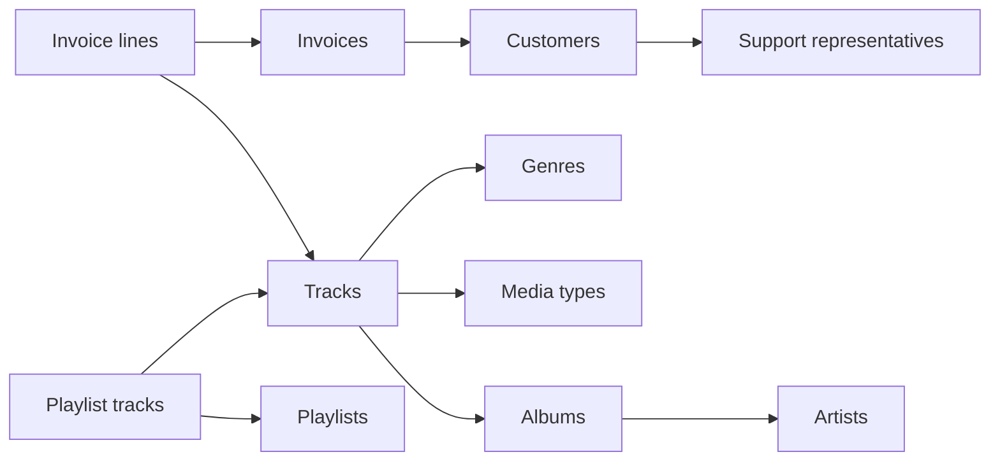

# Chinook: a multi-table semantic layer example

[English](README.md) | [한국어](README.ko.md)

Try Decision Layer against a music store model with **11 related source tables**, nine Cube cubes and one sales view. One command loads the data, starts Cube and opens the same analysis API used by Web and MCP. No warehouse account or manually generated local token is needed.

The source is [Chinook Database 1.4.5](https://github.com/lerocha/chinook-database/releases/tag/v1.4.5), by Luis Rocha. The importer downloads the official JSON release and verifies its SHA-256. See [source attribution and permission](NOTICE.md). Music catalog data comes from an iTunes library; customers are fictitious and transactions are generated. This is a reproducible developer example, not evidence of real business effects or improved AI accuracy. For a larger real transaction dataset, use [Online Retail II](../online-retail/README.md).

## Start

With Docker and Compose installed, enter the example directory:

```bash
cd examples/chinook
docker compose up -d --build --wait
```

Open **http://localhost:3000/catalog**. The Cube connection is already configured. Look for **Track sales**. The first start builds the app and downloads about 1.8 MB of data. Later starts reuse the source cache and imported rows. Recipes start empty so you can test exploration before creating a reusable procedure.

| Service | Image | Default host address | Address inside this stack |
| --- | --- | --- | --- |
| Source database | `postgres:16.4` | `localhost:5433` | `postgres:5432` |
| Semantic API | `cubejs/cube:v1.6.25` | `http://localhost:4000/cubejs-api/v1` | `http://cube:4000/cubejs-api/v1` |
| Decision Layer API | Built from this repository | `http://localhost:8000/docs` | `http://api:8000` |
| Decision Layer Web | Built from `web/` | `http://localhost:3000` | `http://web:3000` |

These are separate containers in the `decision-layer-chinook` project. They do not connect to any private infrastructure. Compose is convenient for this four-service example; the main application can still connect to an independently deployed Cube.

If a port is occupied:

```bash
WEB_PORT=3013 API_PORT=8013 CUBE_PORT=4013 POSTGRES_PORT=5434 \
  docker compose up -d --build --wait
```

Only the host addresses change. Container-to-container addresses stay the same. For persistent custom ports, copy `.env.example` to `.env` in this directory and edit the four values. Compose then uses those ports on later commands too. Keep running Compose commands from this directory.

The source database is `chinook`; a SQL client can use `chinook_reader` / `local-read-only`. Cube uses that same read-only role. The importer's separate account creates and loads tables. The Cube secret and database passwords in this example are public development credentials; all published ports bind to localhost.

## What the model demonstrates



| Source table | Rows | Grain |
| --- | ---: | --- |
| `invoice` | 412 | One invoice |
| `invoice_line` | 2,240 | One purchase line |
| `customer` | 59 | One customer |
| `employee` | 8 | One employee |
| `track` | 3,503 | One catalog track |
| `album` | 347 | One album |
| `artist` | 275 | One artist |
| `genre` | 25 | One genre |
| `media_type` | 5 | One media format |
| `playlist` | 18 | One playlist |
| `playlist_track` | 8,715 | One playlist-track membership |

Cube owns every measure and join. The `music_sales` view combines historical purchase-line sales, invoice dates, billing countries, customer countries, representatives and product dimensions. It uses `invoice_line.unit_price * quantity`; current track list prices and repeated invoice totals do not redefine sales.

Decision Layer keeps canonical references to the base members (`invoice_line.sales`, `invoice.invoice_date`, `genre.genre_name`). The provider automatically uses the covering Cube view when querying them; view aliases do not create duplicate catalog metrics. The executed view query remains in the Run evidence.

Invoice totals and purchase-line totals reconcile to **2,328.60**. Simply summing invoice totals after joining lines produces **20,848.62**, demonstrating why grain matters. The dataset does not specify a currency. Playlist membership is loaded but deliberately omitted from the sales view: its many-to-many membership has no purchase attribution or exposure timeline. Contact details are not exposed in Cube.

## Ask a question through MCP

Install the adapter from the repository root:

```bash
python3.11 -m venv .venv
.venv/bin/pip install -e '.[mcp]'
```

Follow the [MCP setup guide](../../docs/guides/mcp.md) for Codex, Claude Code or Claude Desktop. Use your overridden API port if applicable. This local service-identity example needs no `DL_TOKEN`. Ask:

> What were purchased-track sales in 2023, and which genre contributed the most? Show the analysis steps and evidence.

The reference answer is **469.58** total sales and **Rock, 156.42**. Open **Runs** in the Web to inspect the question, registered Methods, metric graph, results and queries. Select successful steps and review them as a Recipe draft. Alternatively, copy `templates/music-sales.yaml` into `recipes/` to try a three-step Recipe. Keep `recipes/` empty when running the Recipe-free smoke test.

Other supported questions include sales by billing country, genre-to-artist drill-down and invoice versus purchase-line counts. Many artist groups are small; the Method's minimum-count policy may exclude them from ranking. The live join test explicitly lowers that threshold for descriptive totals, without claiming statistical significance. Profit, playlist causality and representative performance effects cannot be inferred from this sample.

Invoices are sparse. Freshness validation may warn that the latest observed purchase precedes a selected period's end, even in a historical period. The source has no ingestion watermark proving that days without invoices are complete; keep this warning visible instead of treating the sample as a production freshness guarantee.

## Verify a Method contribution

Check six independent SQL reference cases, the 11-table import and Cube's read-only database role:

```bash
docker compose run --rm --no-deps import python verify.py
```

With development dependencies installed, return to the repository root and exercise MCP through the shared API and real Cube joins:

```bash
DL_CHINOOK_API_URL=http://localhost:8000 \
  .venv/bin/pytest -q -s tests/provider/test_chinook_live.py
```

[`evals/cases.json`](evals/cases.json) records the questions, independent reference SQL, expected values and interpretation limits. Two refusal cases require interpretation review. The smoke test selects Methods explicitly and does not evaluate an LLM's planning ability. To evaluate an actual AI client, follow the [comparison protocol](../online-retail/evals/PROTOCOL.md), report the client/model and repeat runs. Do not report an improvement percentage from these public regression cases alone.

## Develop the API or Web locally

Start only the data services:

```bash
docker compose up -d --build --wait postgres import cube
```

Then return to the repository root and follow [Contributing](../../CONTRIBUTING.md) for editable Python and Web installation. Start the local API with the same semantic source and a separate development Run store:

```bash
mkdir -p data examples/chinook/recipes
CUBE_API_URL=http://localhost:4000/cubejs-api/v1 \
CUBE_INSTANCE=chinook \
CUBE_API_SECRET=local-example-secret-change-me-0123456789 \
DL_ALLOW_SERVICE_CREDENTIALS=true \
DL_RECIPES_DIR=examples/chinook/recipes \
DL_DATABASE_URL=sqlite:///./data/chinook-development.db \
  .venv/bin/uvicorn decision_layer.api.app:app --reload --port 8000
```

If the container API already occupies port 8000, stop its `api` and `web` services or use a different API port and point the local Web/MCP client at it. Use the configured host Cube port when it differs from 4000. Changes to files under `cube/model/` are mounted directly into the development Cube.

## Troubleshoot and stop

```bash
docker compose ps -a
docker compose logs --tail=100 import cube api
docker compose down
```

Run these commands from the example directory. An import download failure appears in `import` logs. Download the official release JSON into `data/ChinookData.json` and retry; offline files still undergo checksum validation. A mismatch stops import rather than silently loading changed data. These downloaded files are Git-ignored.

The source database, download cache and **Decision Layer's SQLite Run database** use separate named volumes. `down` preserves them. Recipe YAML lives in the ignored local `recipes/` folder and can be placed under your own Git workflow. `down -v` deletes the example's database, cache and Runs; it does not remove the local Recipe folder. No shared proposal approval or production login is implied by this local demo.
