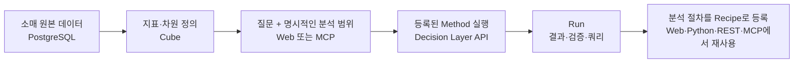
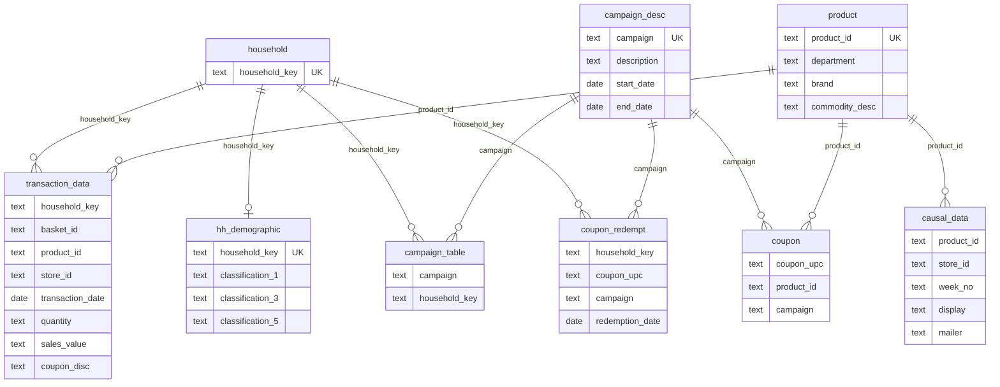
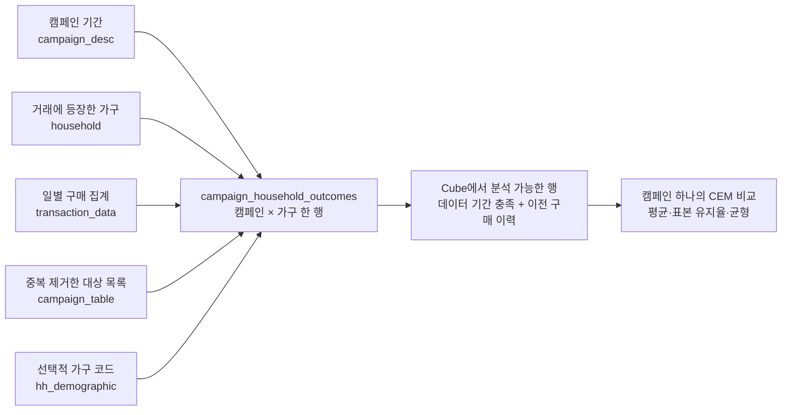

# Complete Journey — 소매 데이터 분석 예제

**한국어** · [English](README.md)

Databricks의 [데이터 준비 예제](https://www.databricks.com/notebooks/segment-p13n/sg_01_data_prep.html)에서 사용한 소매점 데이터입니다.
고객 가구·상품·거래·캠페인·쿠폰 데이터를 로컬 PostgreSQL에 적재하고 Cube를 통해 분석합니다.
Databricks 계정, Spark 설치, 수동 로컬 토큰 발급은 필요하지 않습니다.

회사의 dbt 환경은 [공식 Semantic Layer API](../../docs/ko/guides/dbt.md)로 연결합니다. 로컬 dbt API는 제공하지 않습니다.

## 어떤 비즈니스 문제를 분석하나요?

소매점 분석가는 “어디서 매출이 발생하는가?”, “어떤 부문이 변화를 주도하는가?”,
“쿠폰과 캠페인을 어떻게 평가할 것인가?”를 반복해서 조사합니다.
이 예제에서는 흩어진 원본 테이블을 Cube의 지표·차원으로 연결하고,
분석 근거를 Run에 남긴 뒤 반복할 절차를 Recipe로 저장하는 과정을 경험할 수 있습니다.

| 비즈니스 질문 | 분석 순서 | 확인할 근거 |
| --- | --- | --- |
| 수취액이 어느 상품 부문에 집중되어 있나요? | 부문별 순위 → 가장 큰 부문의 브랜드 유형별 구성 | 부문·브랜드별 금액과 실행 쿼리 |
| 수취액은 어떻게 변했나요? | 월별 추이 → 기간 비교 → 상품 부문별 변화와 구매 수량 확인 | 비교 기간, 변화 금액, 함께 확인한 지표 |
| 특정 매장의 쿠폰 사용 양상이 다른가요? | 같은 부문의 다른 매장 및 접근 가능한 전체 집단과 쿠폰 거래 행 비율 비교 | 집단 필터와 비율 차이; 차이만으로 이상 행위를 단정하지 않음 |
| 캠페인 대상 가구의 이후 구매금액이 더 높은가요? | 캠페인 하나 선택 → 이전 구매금액·빈도 매칭 → 가구 코드 추가 후 비교 가능성 확인 | 매칭 전후 평균, 표본 유지율, 균형 진단, 분석 거부 사유 |

위 질문은 조사할 과제이며 미리 계산된 결론이나 기본 제공 Recipe가 아닙니다.
처음에는 Recipe가 비어 있습니다. 분석을 실행하고 Run을 검토한 뒤 절차를 등록해 재사용하세요.



**읽는 순서:** [실행](#실행) → [데이터 구조](#데이터-구조) → [MCP로 질문하기](#mcp로-질문하기) → [캠페인 가구 비교](#캠페인-가구-비교).

## 실행

저장소 루트에서:

```bash
cd examples/complete-journey
docker compose -p decision-layer-cube up -d --build --wait --wait-timeout 900
```

PostgreSQL, Cube, API와 Web이 실행됩니다. **http://127.0.0.1:3000/catalog** 로 접속하세요.
처음 설치하면 Cube 연결이 자동 설정되고 Recipe는 비어 있습니다. 기존에 저장한 연결은 유지됩니다.
첫 실행에는 공식 원본 약 128 MB 다운로드와 8개 테이블 적재로 몇 분이 걸립니다.
프로모션 테이블이 커서 시간이 걸리며, 이후에는 캐시와 DB를 재사용합니다.
오프라인 환경에서는 원본 압축 파일을 `data/complete-journey.zip`에 두세요. 체크섬 검증은 그대로 수행합니다.

| 서비스 | 이미지 | 호스트 포트 |
| --- | --- | --- |
| Web | 이 저장소에서 빌드 | 3000 |
| API | 이 저장소에서 빌드 | 8000 |
| Cube | cubejs/cube:v1.6.25 | 4000 |
| 원본 PostgreSQL | postgres:16.4 | 5433 |

포트가 사용 중이면 `.env.example`을 `.env`로 복사해 호스트 포트를 바꾸세요.
Compose 명령은 이 폴더에서 실행합니다. 모든 포트는 127.0.0.1에 바인딩됩니다.
Cube는 SELECT만 허용된 계정으로 원본을 조회하며, 공개된 접속 정보는 로컬 개발용입니다.

## 데이터 구조

### 테이블의 한 행은 무엇인가요?

**원본 테이블 8개**를 적재하고 가구 키 테이블과 캠페인 × 가구 결과 모델을 생성합니다.
아래 컬럼명은 PostgreSQL의 소문자 이름입니다. 원본 CSV 헤더는 대소문자가 섞여 있습니다.

| 테이블 | 한 행의 의미 | 주요 컬럼 | 이 예제에서의 용도 |
| --- | --- | --- | --- |
| `transaction_data` | 장바구니 안에서 구매한 상품의 거래 행 | `household_key`, `basket_id`, `product_id`, `store_id`, `transaction_date`, `quantity`, `sales_value`, `coupon_disc` | 수취액·수량·장바구니 수·쿠폰 거래 행 비율·추이 |
| `product` | 상품 하나 | `product_id`, `department`, `brand`, `commodity_desc` | 상품 부문·브랜드 유형·품목별 분석 |
| `hh_demographic` | 가구에 대해 제공된 분류 코드 | `household_key`, `classification_1`, `classification_3`, `classification_5` | 선택적 가구 비교 조건; 모든 가구에 존재하지 않음 |
| `campaign_desc` | 캠페인 하나 | `campaign`, `description`, `start_date`, `end_date` | 캠페인 유형과 기간 |
| `campaign_table` | 원본 캠페인–가구 대상 목록 기록 | `campaign`, `household_key` | 대상 여부; 결과 모델 생성 시 중복 제거 |
| `coupon` | 쿠폰–상품–캠페인 매핑 | `coupon_upc`, `product_id`, `campaign` | 향후 모델링을 위해 적재한 연결 테이블; 현재 Cube 모델 없음 |
| `coupon_redempt` | 가구의 쿠폰 사용 기록 | `household_key`, `coupon_upc`, `campaign`, `redemption_date` | 거래 행과 별도로 쿠폰 사용 건수 분석 |
| `causal_data` | 상품·매장·주차별 프로모션 배치 기록 | `product_id`, `store_id`, `week_no`, `display`, `mailer` | 향후 모델링을 위해 적재; 이름이 인과관계를 보장하지 않음 |
| `household` *(파생)* | 거래에 등장한 고유 가구 | `household_key` | 분류 코드가 없는 구매 가구도 유지 |
| `campaign_household_outcomes` *(파생)* | 캠페인 하나 × 가구 하나 | `observation_id`, `is_targeted`, `pre_sales_band`, `pre_frequency_band`, `post_sales_30d`, `eligible` | 전후 기간을 정의한 가구 매칭 비교 |

### 원본 데이터 ERD

**논리적 관계도**입니다. DB의 외래 키 제약이나 모든 Cube 조인을 선언한 그림은 아닙니다.
가구 분류는 선택적으로 연결하여 정보가 없는 가구도 유지합니다.
쿠폰 매핑과 프로모션 배치 데이터는 적재하지만 현재 거래 Cube 모델에 조인하지 않습니다.



`coupon_upc`와 `campaign`은 쿠폰 사용 기록과 상품 매핑을 개념적으로 연결합니다.
쿠폰 매핑에는 여러 상품이 포함될 수 있으므로 사용 기록이나 거래 행에 바로 조인하면 행이 증식할 수 있습니다.
한 가구가 여러 캠페인의 대상일 수도 있습니다. 캠페인 접촉과 쿠폰 사용은 별도의 사실 테이블이며,
각 거래 행에 붙이는 속성으로 취급하지 않습니다. `store_id`와 `week_no`는 이 예제에서 별도 차원 테이블이 없는 필드입니다.

### 원본 데이터가 Catalog에 어떻게 보이나요?

Cube는 [`cube/model/cubes/`](cube/model/cubes/)에 7개 모델을 정의합니다.
두 View는 분석에 쓸 필드들을 묶어서 제공하며 개별 모델의 멤버도 노출됩니다.

| 분석 모델 / View | 원본과 분석 단위 | 사용할 지표·차원 |
| --- | --- | --- |
| `retail_transactions` View | 거래 행 + 상품 + 가구 | 수취액, 수량, 거래 행·장바구니 수, 쿠폰 거래 행 비율; 매장, 부문, 브랜드 유형, 가구 코드, 거래일 |
| `campaign`, `campaign_contact`, `redemption` 모델 | 각각 캠페인, 대상 목록 기록, 쿠폰 사용 기록 | 캠페인·접촉·쿠폰 사용 건수와 각 모델의 차원 |
| `campaign_analysis` View | 분석 조건을 충족한 캠페인 × 가구 | 전후 평균 구매금액, 이전 평균 구매 빈도, 관측 수, 대상 여부, 매칭 구간 |

원본 컬럼은 대부분 텍스트로 적재하고 Cube에서 숫자 지표를 변환합니다.
적재기는 거래일·쿠폰 사용일·캠페인 시작일·종료일을 PostgreSQL `DATE`로 추가하며 원본 상대 일수도 보존합니다.

| 지표 / 시간 | 이 예제의 정의 | 해석 |
| --- | --- | --- |
| 소매점 수취액 | `sales_value` 합계 | 소매점이 받은 금액; 이익이나 고객의 실제 지불액과 동일하지 않음 |
| 구매 수량 | `quantity` 합계 | 구매한 상품 수량 |
| 장바구니 수 | 조회 범위의 고유 `basket_id` 수 | 하나의 장바구니에 여러 상품 거래 행이 포함될 수 있음 |
| 쿠폰 거래 행 비율 (%) | `100 × coupon_disc < 0인 거래 행 수 / 전체 거래 행 수` | 쿠폰 할인이 적용된 행의 비율; 가구 비율이나 장바구니 비율이 아님 |
| 거래일 | `2000-01-01 + (DAY - 1)` | 고정 예제 달력; 원본의 실제 구매 연도를 의미하지 않음 |

이 달력에서 거래 기간은 **2000-01-01 ~ 2001-12-11**입니다.
구매 기간 질문에는 **Transaction date(거래일)**를 사용하세요. 캠페인 시작·종료일과 쿠폰 사용일은 다른 사건의 날짜입니다.
Web은 제공자에 추천 기간이 있으면 사용합니다. 가구 분류는 배포자의 코드이며 실제 나이·소득으로 추정하지 않습니다.
이용·재배포 조건은 [출처 안내](NOTICE.md)를 확인하세요.

## MCP로 질문하기

[MCP 연결 가이드](../../docs/ko/guides/mcp.md)에 따라 `DL_API_URL=http://127.0.0.1:8000`으로 연결합니다.

**1. 수취액 구성 조사**

> 전체 데이터에서 소매점 수취액이 가장 큰 상품 부문은 어디야? 그 부문을 브랜드 유형별로 나누고 근거도 보여줘.

고정된 원본의 독립 SQL 검증값은 **GROCERY = 4,093,814.14**, **전체 수취액 = 8,057,463.08**입니다.
[`verify.py`](verify.py)가 이를 검증합니다. 필터를 적용하거나 매칭한 집단의 기준값으로 사용하지 마세요.

**2. 매장 간 쿠폰 활동 비교**

> 364 매장의 식료품 쿠폰 거래 행 비율을 같은 상품 부문의 다른 매장 및 접근 가능한 전체 집단과 비교해줘.

**3. 기간별 변화 조사**

> 2001년 7월부터 9월까지 수취액의 월별 추이를 보고 상품 부문별로 나눠줘.

Runs에서 질문·분석 단계·설정·쿼리를 확인합니다. **Recipe로 등록**은 실행한 절차를 저장하고,
**편집해서 저장**은 후보를 수정한 뒤 저장합니다. 관찰 데이터의 차이를 캠페인 인과 효과로 단정하지 마세요.
쿠폰 사용자는 처치 이후 선택된 집단입니다. 인과 분석에는 사전 공변량, 명시적인 처치·결과 기간,
비교 집단의 겹침과 식별 논거가 필요합니다.

## 캠페인 가구 비교

거래 행을 그대로 비교하는 대신 **캠페인 × 가구** 모델로 구매 기간과 분석 단위를 맞춥니다.
여러 캠페인을 합치면 같은 가구가 반복되므로 먼저 캠페인 하나를 선택하세요.



| 캠페인 시작일 `S` 기준 | 이전 30일 | 이후 30일 |
| --- | --- | --- |
| 구매 기간 | `S − 30 ≤ 거래일 < S` | `S ≤ 거래일 < S + 30` |
| 분석에서의 역할 | 구매금액·빈도 구간을 매칭 조건으로 사용 | 가구 구매금액을 결과로 사용 |

대상 가구는 **해당 캠페인의 대상 목록에 있는 가구**입니다. 비대상 가구는 해당 목록에 없다는 뜻이며,
다른 마케팅에도 노출되지 않았다는 뜻은 아닙니다. 양쪽 구매 기간이 데이터 기간 안에 들어오고
이전 기간에 구매 이력이 있는 가구만 분석합니다. 이후 구매가 없으면 결과 금액은 0입니다.
데이터 전체 기간이 충분하다는 사실만으로 개별 가구의 추적이 완전하다고 볼 수는 없습니다.
이 모델의 날짜 필터는 **캠페인 시작일**을 선택하며 상대적인 30일 구매 기간을 자르지 않습니다.

> 8번 캠페인의 대상 가구는 비대상 가구보다 시작 후 30일간 가구당 평균 판매금액이 높았어?
> 이전 30일 구매금액과 구매 빈도를 맞춰 비교하고, 가구 특성까지 추가하면 비교 가능한 표본이 충분한지도 확인해줘.
> 두 단계를 하나의 Run에 남기고, 조건을 임의로 빼거나 통계적으로 유의하다고 주장하지 마.

정의·한계·기존 볼륨 업데이트는 [캠페인 분석 가이드](CAMPAIGN_ANALYSIS.ko.md)를 참고하세요.
평균 구매금액의 유의성 검정은 아직 지원하지 않습니다.
공식 hosted dbt API의 metadata만으로는 평균·표본 수·기본 단위를 검증할 수 없어 해당 CEM 경로를 지원하지 않습니다.

## 검증과 문제 해결

```bash
docker compose -p decision-layer-cube run --rm --no-deps import python verify.py
docker compose -p decision-layer-cube logs --tail=100 import cube api
docker compose -p decision-layer-cube down
```

검증기는 독립 SQL 합계를 확인하고 상품 조인이 거래 행을 늘리지 않는지 검사합니다.
적재기는 체크섬과 행 수를 트랜잭션으로 기록합니다. 적재가 중단되면 롤백하여 부분 데이터를 노출하지 않습니다.
Run은 이름 있는 볼륨에, Recipe 파일은 `recipes/`에 저장됩니다. 처음에는 비어 있고 재시작하면 기록이 유지됩니다.
`down`은 데이터·캐시·Run 볼륨과 로컬 Recipe 파일을 보존합니다. `down -v`는 이름 있는 볼륨을 삭제합니다.

이전에 `decision-layer-journey` 또는 `decision-layer-onboarding`으로 실행했다면 같은 폴더에서
`docker compose -p decision-layer-journey down` 또는 `docker compose -p decision-layer-onboarding down`으로 먼저 종료하세요.
기존 볼륨은 삭제하거나 자동 이전하지 않습니다. 다른 폴더에 clone해도 같은 프로젝트 이름이면 볼륨이 재사용됩니다.

기존 DB는 다음 명령으로 업데이트합니다. 원본 행을 다시 적재하거나 삭제하지 않습니다.

```bash
docker compose -p decision-layer-cube build import
docker compose -p decision-layer-cube run --rm --no-deps import
docker compose -p decision-layer-cube restart cube api
```

[로컬 개발](../../docs/ko/guides/development.md), [Method 기여](../../docs/ko/guides/methods.md),
[테스트](../../docs/ko/guides/testing.md)를 참고하세요. 원본 데이터는 저장소에 포함하지 않으며
사용 환경 안에 보관합니다. 재배포 전 배포자의 이용 조건을 확인하세요.
