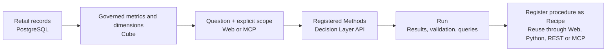
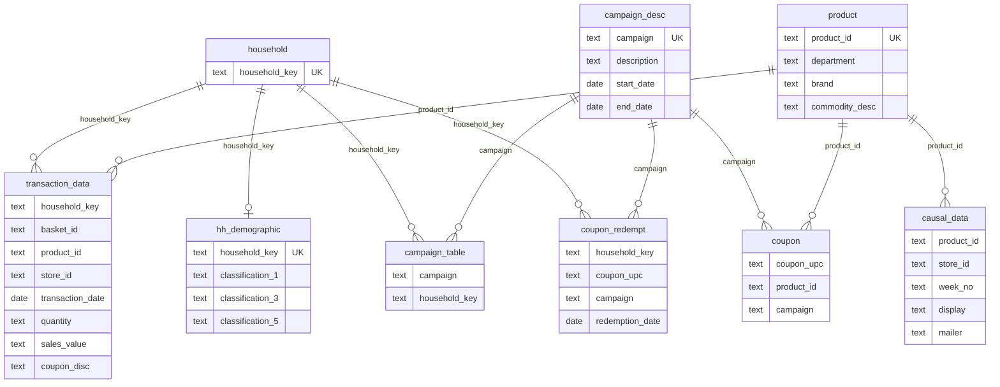
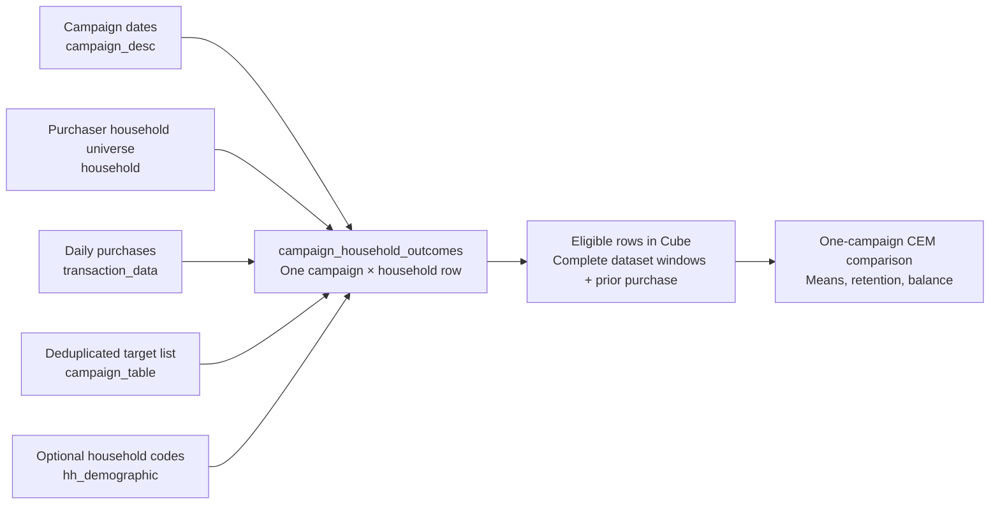

# Complete Journey — Retail Analysis Walkthrough

[한국어](README.ko.md) · **English**

The multi-table retail example used by the linked [Databricks data preparation notebook](https://www.databricks.com/notebooks/segment-p13n/sg_01_data_prep.html), loaded into local PostgreSQL. The local sample runs Cube.
No Databricks account, Spark installation or manually issued local token is needed.

For an existing dbt deployment, use the [official Semantic Layer API connection](../../docs/guides/dbt.md). No local dbt API is bundled.

## What business problems does this example address?

Imagine a retail analyst investigating sales performance and marketing activity. Purchase lines,
customer households, campaign target lists and coupon redemptions live in separate tables.
This example shows how to turn those records into governed metrics, an evidence-backed investigation,
and a reusable analytical procedure.

| Business question | Investigation | Evidence to inspect |
| --- | --- | --- |
| Where are receipts concentrated? | Rank departments, then break the leading department down by brand type. | Department/brand breakdown and the queries behind it. |
| What changed in receipts? | Inspect a monthly trend, compare periods, then investigate department contributions and units. | Period definitions, change amounts and supporting metrics. |
| Is one store's coupon activity unusual? | Compare its coupon-line rate with other stores in the same department and the accessible overall population. | Population filters and rates; a difference alone does not establish misconduct. |
| Do campaign-targeted households spend more afterward? | Select one campaign, match prior purchase bands, then test whether household codes leave enough comparable observations. | Raw/matched means, retained sample, balance and any refusal. |

These are questions to investigate, not precomputed conclusions or bundled Recipes.
The sample starts with an empty Recipe library: execute a procedure, inspect its Run, then register it for reuse.



**Reading path:** [Start](#start) → [Data structure](#data-structure) → [Ask through MCP](#ask-through-mcp) → [Campaign comparison](#campaign-comparison).

## Start

From the repository root:

```bash
cd examples/complete-journey
docker compose -p decision-layer-cube up -d --build --wait --wait-timeout 900
```

This starts PostgreSQL, Cube, API and Web. Open **http://127.0.0.1:3000/catalog**. A fresh installation connects Cube and starts without Recipes. Existing saved connections take precedence.
First startup downloads the official 128 MB archive and streams all eight source tables into PostgreSQL.
The promotion table is large, so allow several minutes. Later starts reuse the cache and database.
For offline setup, place the original archive at `data/complete-journey.zip`; its checksum is still checked.

| Service | Image | Host port |
| --- | --- | --- |
| Web | Built from this repository | 3000 |
| API | Built from this repository | 8000 |
| Cube (Cube example) | cubejs/cube:v1.6.25 | 4000 |
| Source PostgreSQL | postgres:16.4 | 5433 |

If ports are occupied, copy `.env.example` to `.env` and change host ports.
Keep Compose commands in this folder. All ports bind to 127.0.0.1.
Cube queries with a SELECT-only source role; public credentials are local-development credentials.

## Data structure

### What does one row represent?

The importer loads **eight source tables**, derives a household key table, and materializes campaign-household outcomes.
Field names below use the lowercase PostgreSQL names; the source CSV headers use mixed case.

| Table | One row represents | Important fields | Use in this example |
| --- | --- | --- | --- |
| `transaction_data` | A purchased product line within a basket | `household_key`, `basket_id`, `product_id`, `store_id`, `transaction_date`, `quantity`, `sales_value`, `coupon_disc` | Receipts, units, baskets, coupon-line rate and trends |
| `product` | A product | `product_id`, `department`, `brand`, `commodity_desc` | Department, brand type and product-category breakdowns |
| `hh_demographic` | Available coded classifications for a household | `household_key`, `classification_1`, `classification_3`, `classification_5` | Optional household comparison conditions; coverage is incomplete |
| `campaign_desc` | A campaign | `campaign`, `description`, `start_date`, `end_date` | Campaign type and timing |
| `campaign_table` | A source campaign–household target-list record | `campaign`, `household_key` | Target-list membership; deduplicated when building outcomes |
| `coupon` | A coupon–product–campaign mapping | `coupon_upc`, `product_id`, `campaign` | Loaded bridge for future modeling; no Cube model yet |
| `coupon_redempt` | A recorded household coupon redemption | `household_key`, `coupon_upc`, `campaign`, `redemption_date` | Redemption counts, separate from purchase lines |
| `causal_data` | A product/store/week promotion-placement record | `product_id`, `store_id`, `week_no`, `display`, `mailer` | Loaded for future modeling; its name does not establish causality |
| `household` *(derived)* | A distinct household found in transactions | `household_key` | Keeps purchasers even when demographics are missing |
| `campaign_household_outcomes` *(derived)* | One campaign × household observation | `observation_id`, `is_targeted`, `pre_sales_band`, `pre_frequency_band`, `post_sales_30d`, `eligible` | Before/after-window matched household comparison |

### Source ERD

This is a **logical relationship map**, not a declaration of database foreign-key constraints or all Cube joins.
The optional demographic relationship preserves households with missing classifications. Coupon mappings and
promotion placements are loaded but are not joined into the current transaction Cube model.



`coupon_upc` and `campaign` connect redemption records to coupon mappings conceptually, but the mapping
can contain multiple products. Joining it directly to redemptions or purchase lines can multiply rows.
Likewise, a household can belong to many campaigns: campaign contacts and redemptions are separate facts,
not attributes to attach to every transaction line. `store_id` and `week_no` are fields, not separate dimension tables here.

### From source tables to the Catalog

Cube defines seven models under [`cube/model/cubes/`](cube/model/cubes/).
Two views provide convenient analytical field sets; individual models also expose their own members.

| Analytical surface | Source and grain | Metrics and dimensions |
| --- | --- | --- |
| `retail_transactions` view | Transaction lines joined to product and household | Receipts, units, line/basket counts, coupon-line rate; store, department, brand type, household codes, transaction date |
| `campaign`, `campaign_contact`, `redemption` models | Campaigns, target-list records and redemption records, respectively | Campaign/contact/redemption counts and their applicable dimensions |
| `campaign_analysis` view | Eligible campaign × household observations | Prior/subsequent mean household sales, prior mean purchase frequency, observation count, target membership and matching bands |

The raw source columns are mostly loaded as text. Cube casts numerical measures; the importer adds
PostgreSQL `DATE` columns for transactions, redemptions and campaign start/end while preserving source day indices.

| Meaning | Definition in this sample | Interpretation |
| --- | --- | --- |
| Retailer receipts | Sum of `sales_value` | Amount received by the retailer; not profit or necessarily customer cash paid |
| Units | Sum of `quantity` | Purchased quantity |
| Purchase baskets | Distinct `basket_id` count in the query scope | Multiple product lines can belong to one basket |
| Coupon-line rate (%) | `100 × lines with coupon_disc < 0 / all transaction lines` | Share of lines with a coupon discount; not share of households or baskets |
| Transaction date | `2000-01-01 + (DAY - 1)` | Fixed example calendar, not the actual purchase year |

Transactions span **2000-01-01 to 2001-12-11** on this calendar. Use **Transaction date** for purchase-period questions;
campaign start/end and redemption dates describe different events. Web uses provider period suggestions when available.
Household classifications are publisher codes, not inferred ages or incomes. See [NOTICE](NOTICE.md) for source terms.

## Ask through MCP

Install and connect using the [MCP guide](../../docs/guides/mcp.md), with `DL_API_URL=http://127.0.0.1:8000`.

> Over all available data, which product department has the largest retailer receipts? Break it down by brand and show the evidence.

> Compare the coupon-line rate of one store with the other stores in the same product department and with the overall accessible population.

> How did retailer receipts change between July and September 2001? Show the monthly trend and break it down by product department.

A useful first check is the all-period department breakdown: [`verify.py`](verify.py) independently asserts
**GROCERY = 4,093,814.14** and **overall receipts = 8,057,463.08** for the pinned archive.
These totals are a reproducibility check, not a baseline for filtered or matched populations.

Open Runs to inspect the question, graph, settings and queries. **Register as Recipe** saves the completed procedure with its recorded settings; **Edit before saving** opens a candidate for changes first.

The dataset supports observational investigation, not a guaranteed campaign causal effect.
Do not equate coupon users with randomized treatment or condition on redemption to define a causal control group.
A causal Recipe needs pre-treatment covariates, explicit treatment/outcome windows, overlap and an identification argument.

## Campaign comparison

The Cube example exposes a **campaign x household** model with prior and subsequent 30-day purchase
windows, target-list membership and prior purchase bands. Start with one campaign, not all campaigns combined.



| Relative to campaign start `S` | Prior 30 days | Subsequent 30 days |
| --- | --- | --- |
| Purchase window | `S − 30 ≤ date < S` | `S ≤ date < S + 30` |
| Role | Prior sales/frequency bands for matching | Household sales outcome |

Targeted means present in **that campaign's target list**. Non-targeted means absent from that list;
it does not mean unexposed to other marketing. Eligible households purchased in the prior window,
and both windows must fit the dataset date bounds. A subsequent non-purchaser contributes zero.
Dataset coverage alone does not prove individual follow-up. A date filter on this model selects
**campaign start dates**, while the relative purchase windows remain fixed.

> For campaign 8, compare subsequent 30-day mean household sales between targeted and non-targeted households,
> matching prior purchase amount and frequency. Then check whether adding household classifications leaves
> enough comparable data. Keep both steps in one Run; do not silently drop conditions or claim significance.

See the [campaign model and CEM guide](CAMPAIGN_ANALYSIS.md) for definitions, limitations and upgrading
existing Cube volumes. Continuous-outcome significance is not supported. Hosted dbt API metadata
does not yet verify this average/count/unit contract and refuses that analysis.

## Verify and troubleshoot

```bash
docker compose -p decision-layer-cube run --rm --no-deps import python verify.py
docker compose -p decision-layer-cube logs --tail=100 import cube api
docker compose -p decision-layer-cube down
```

Runs persist in the named volume; Recipe files live in `recipes/`. A fresh sample starts with no Runs or Recipes. Restarting preserves its records.

If you previously used `decision-layer-journey` or `decision-layer-onboarding`, stop it first with `docker compose -p decision-layer-journey down` or `docker compose -p decision-layer-onboarding down` from this directory. Existing volumes are not deleted or automatically migrated. Cloning into another folder still reuses volumes if the project name is the same.

The verifier reports independent SQL totals and checks a product join does not multiply lines.
`down` preserves named data/cache/Run volumes and local Recipe files; `down -v` deletes named volumes.
The importer records a digest and row counts transactionally; interrupted imports roll back rather than presenting partial data.
Existing volumes are upgraded on the next import without reloading or deleting source rows:

```bash
docker compose -p decision-layer-cube build import
docker compose -p decision-layer-cube run --rm --no-deps import
docker compose -p decision-layer-cube restart cube api
```

See [local development](../../docs/guides/development.md), [Method contribution](../../docs/guides/methods.md)
and [tests](../../docs/guides/testing.md). Keep the source data private to your environment; review publisher terms before redistribution.
